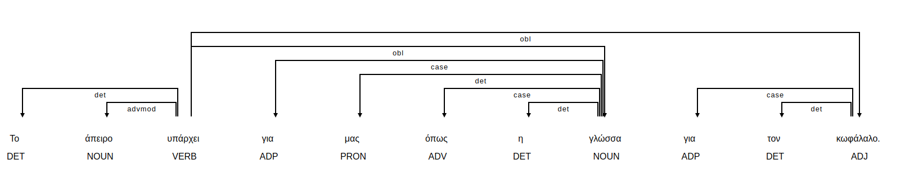
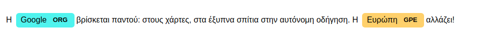
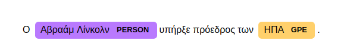
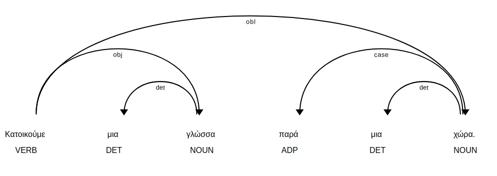

# Google Summer of Code 2018 Project - spaCy now speaks Greek

Welcome to the home repository of Greek language integration for spaCy.

This project is developed for **Google Summer of Code 2018**, under the auspices of **GFOSS - Open Technologies Alliance**.


## Readme Contents

1. [Project links](#project-links) 
2. [Problem Statement](#problem-statement-and-project-goals)
3. [Results](#results)
   * [Open Source Text Analysis Tool - Demo](#nlpbuddy-demo)
   * [Integration of Greek language to spaCy](#addition-of-greek-language-to-spacy)
   * [Greek language models](#greek-language-models)
   * [Improvements in spaCy](#improvements-in-spacy)
4. [Deliverables](#deliverables)
   * Tokenizer
   * Lemmatizer
   * Sentence splitter
   * Stop words
   * Norm exceptions
   * Lexical attributes
   * Part of Speech Tagger
   * NER Tagger
   * Sentiment Analyzer
   * Topic classifier
5. [Future work](#future-work)
6. [People](#people)


## Project links


For this project, there is a daily basis **timeline** that keeps track of all the progress done for Google Summer of Code 2018. You can view the timeline [here](https://github.com/eellak/gsoc2018-spacy/projects/1).

There is also a **report page** for the final evaluation for Google Summer of Code 2018. You can view the report page [here](https://nlpbuddy.io/gsoc).

What is really important, is the **project Wiki**, which holds information about every aspect of the addition of the Greek language to spaCy. You can view the project Wiki [here](https://github.com/eellak/gsoc2018-spacy/wiki).

Also, there is the **NLPBuddy repository**. NLPBuddy is a side result project of Google Summer of Code on top of spaCy which supports high quality NLP features such as syntax analysis, emotion analysis, topic classification  and  of course makes use of the Greek language support. You can find the repository [here](https://github.com/eellak/nlpbuddy) and the Wiki page of this demo [here](https://github.com/eellak/nlpbuddy/wiki).


## Problem statement and project goals 

We live in the era of data. **Every minute**, 3.8 billion internet users, produce content; more than 120 million emails, 500,000 Facebook comments, 3 million Google searches. If we want to process that amount of data efficiently, we need to process natural language. Open source projects such as spaCy, textblob, or NLTK contribute significantly to that direction and thus they need to be reinforced.

This project is about improving the quality of Natural Language Processing of Greek Language. 

The **project goals** can be categorized as following: 

1. [Addition of Greek language to spaCy](https://github.com/explosion/spaCy/pull/2558).  **Status: Complete**
2. Production of models for Part-Of-Speech (POS) tagging, Dependency Analysis (DEP) and Named Entities Recognition (NER), with and without word vectors.  **Status: Complete**
3. An [open-source text analysis tool](https://nlpbuddy.io) (demo) in which everyone can perform common NLP tasks in 7 languages. **Status: Complete**.
4. **Bonus goal:** Usage of the addition of Greek language for sentiment analysis and other challenging NLP tasks.


## Results


### Addition of Greek language to spaCy

Greek language has been successfully integrated to spaCy, which was actually the most important goal of the project.

There were two pull requests for this purpose; the first was the initial addition of the language and the second pull request contained important optimizations that made the support for the Greek language probably the most complete in terms of features after the English language. 

*Addition of the language*: You can see the first pull request [here](https://github.com/explosion/spaCy/pull/2558).

*Optimizations to the Greek language class*: You can see the second pull request [here](https://github.com/explosion/spaCy/pull/2658).

Each part of the process of integrating Greek language to spaCy is discussed in detail in the [Wiki](https://github.com/eellak/gsoc2018-spacy/wiki) page of the project.


### Greek language models

Two models for Greek language have been produced. There is an ongoing process of uploading them to spaCy release.

After that, you will be able to install them with the following commands:

```bash
python3 -m spacy download el_core_web_sm
python3 -m spacy download el_core_web_lg
```


Greek language models support most of the capabilities that you will find in the [deliverables](#deliverables) section. Sentence splitting, tokenization, Part Of Speech Tagging, Syntax Analysis using DEP tags, Named Entities Recognition, lexical attributes extraction, norm exceptions and stop-words lists, are all included the Greek language models. The big Greek model (el_core_web_lg) includes word vectors so it supports features such as similarity detection between texts.   You can find more about the models production, usage and maintenance, in the [models page of the wiki](https://github.com/eellak/gsoc2018-spacy/wiki/models).   Some visualizations from the models usage:

 


   



 


### NLPBuddy demo

An open-source text analysis tool has been developed as a demonstration of the project results. 

The demo leverages [Spacy's](https://spacy.io)  capabilities to extract as much information as possible from a raw text. 

**Experiment yourself with the demo**:  [https://nlpbuddy.io](https://nlpbuddy.io)

Briefly, in this demo you can perform the following tasks with your text:

1. Language identification (performed using [langid](https://github.com/saffsd/langid.py) library).
2. Text tokenization.
3. Sentence splitting.
4. Lemmatization.
5. Part of Speech tags identification.
6. Named Entity Recognition (Location, Person, Organization).
7. Text summarization (uses [Gensim's](https://github.com/RaRe-Technologies/gensim) implementation of the TextRank algorithm).
8. Keywords extraction.
9. For the Greek language:
   * **Text classification** among the following categories: Sports, Science, World News, Greek News, Environment, Politics, Art, Health, Science. The Greek classifier is built with [FastText](https://fasttext.cc) and is trained in 20.000 articles labeled in these categories. **Accuracy reaches 90%**,
   * **Text subjectivity analysis**.
   * **Emotion analysis**. It detects the main text emotion among the following emotions: Anger, Disgust, Fear, Happiness, Sadness, Surprise.

Currently, it supports the features mentioned above for text in one of the following languages: Greek, English, German, Spanish, Portuguese, French, Italian and Dutch. 

Text can either be provided or imported from a URL. Libraries used: [python readability](https://github.com/buriy/python-readability), [BeautifulSoup4](https://www.crummy.com/software/BeautifulSoup/).

*Note*: All the functionalities that demo supports (and some more) are implemented as modules so anybody can use them independently.  Those modules are extensively discussed in the [deliverables](#deliverables) section. The central idea is that this Google Summer of Code project should produce results that are going to be used later on from people all around the world. For that reason, together with my mentor, Markos Gogoulos, we have implemented an API for the Demo so anybody can access the results that it provides (see more [here](https://github.com/eellak/nlpbuddy/wiki/API-usage)).


### Improvements in spaCy

A side goal of the project is to empower spaCy itself.

There is an open-dialogue with the creators of spaCy, who we would like to thank for their continuous support and enthusiasm.


#### Documentation improvements

A pull request for documentation improvements was successfully merged.

The pull request was about a small error found in the spaCy documentation in the pseudocode provided for overriding the spaCy tokenizer. 

You can see the pull request [here](https://github.com/explosion/spaCy/pull/2604).


#### Sharing awareness

I am invited to write an article for [Explosion AI Blog ](https://explosion.ai/blog/)regarding the integration of Greek language to spaCy due to the innovative approaches followed during Google Summer of Code 2018. There is an ongoing process of writing and evaluation of this article till its' publication which may be after the end of Google Summer of Code.   A link to the post will be published here when it's ready.


#### Innovative approaches

In the process of integrating Greek language to spaCy some new approaches are followed. Hopefully, these approaches will inspire other languages too.

- The Greek language is the second language that follows a rule based lemmatization procedure.
- There were no available data for training NER classifier, so there was a need for creating data. A fast procedure of annotating data using Prodigy annotation tool is proposed for future reference.


## Deliverables

Deliverables are independent functionality submodules or/and useful resources that were produced either during the process of integrating Greek language to spaCy or during the process of experimenting with the functionalities of spaCy and the demo implementation. 

A list of the deliverables and a short description of each of them follows. You can find the functionality submodules in the res/modules folder of the project repo ([here](https://github.com/eellak/gsoc2018-spacy/tree/5ca7746630a3a985da6ccfd48a51be74e8c7d44a/spacy/lang/el/res/modules)), serving as examples for usage. 

If you want to learn more, there is an individual page for each of them in the [project wiki](https://github.com/eellak/gsoc2018-spacy/wiki) or the [demo wiki](https://github.com/eellak/text-analysis/wiki). 

### Deliverables list

1. Tokenizer

   You can use this submodule having one of the produced greek models in order to **split** your sentence(s) to **tokens**, independently of the others spaCy modules. 
   Sample input: *Θέλω να μου σπάσεις αυτήν την πρόταση σε κομμάτια*
   Sample output: *[Θέλω, να, μου, σπάσεις, αυτήν, την, πρόταση, σε, κομμάτια]* 
   Submodule [link](https://github.com/eellak/gsoc2018-spacy/blob/dev/spacy/lang/el/res/modules/tokenizer.py). 

2. Lemmatizer

   This submodule is for **sentences lemmatization**. 

   Sample input: 

   ```
   Τα σύμβολα του αγώνα.
   ```

   Sample output:

   ````
   Original token: Τα , Lemma: τα
   Original token: σύμβολα , Lemma: σύμβολο
   Original token: του , Lemma: του
   Original token: αγώνα , Lemma: αγώνας
   Original token: . , Lemma: .   
   ````

   
   Greek lemmatizer is special because it follows a rule based approach. You can find extensive documentation about lemmatizer in the corresponding wiki [page](https://github.com/eellak/gsoc2018-spacy/wiki/Lemmatizer). Submodule [link](https://github.com/eellak/gsoc2018-spacy/blob/dev/spacy/lang/el/res/modules/lemmatizer.py). 

3. Sentence Splitter

   You can use this submodule using one of the produced greek models in order to **split sentences** in a greek text independently of the rest of the spaCy modules. 

   Sample input: 

   ```
   Αυτή είναι μια πρόταση. Αυτή είναι μια δεύτερη πρόταση. Και αυτή μια τρίτη πρόταση. 
   ```

   Sample output:

   ````
   [ Αυτή είναι μια πρόταση., Αυτή είναι μια δεύτερη πρόταση., Και αυτή μια τρίτη πρόταση.] 
   ````

   
   Submodule [link](https://github.com/eellak/gsoc2018-spacy/blob/dev/spacy/lang/el/res/modules/sentence_splitter.py).

4. Stop-words list.

   ![](data:image/jpeg;base64,/9j/4AAQSkZJRgABAQAAAQABAAD/2wCEAAkGBxIQEBAQEBAVFRUVFRgVEhUXFhUPFRUVFhYYGBcVFRcYHSghGBolHRYWITEhJikrLi4uGB8zODMtNygtLisBCgoKDg0OGxAQGy0lHyUtLS0tLS0tLS0tLSstLS0tLS0tLS0tLS0tLS0tLS0tLS0tLS0tLS0tLS0tLS0tLS0tLf/AABEIAJ0BLAMBEQACEQEDEQH/xAAbAAEAAgMBAQAAAAAAAAAAAAAABAUBAgMGB//EADoQAAICAQMDAgQEBAMIAwAAAAECAxEABBIhBTFBE1EGIjJhFCNxgUJSkaEzYtEVcnOxweHw8RaCov/EABoBAQADAQEBAAAAAAAAAAAAAAABAgMEBQb/xAAvEQACAgEEAgEDAgYDAQEAAAAAAQIDEQQSITETQSJRYXEUgQUykaGxwULw8eEj/9oADAMBAAIRAxEAPwD7jgDAGAMAYAwBgDAGAMAwMjIyMkGcAxgDAGQMmCcJoZRhWB7H/wB4WCFhm2PwSMd9gwRjAaBNZEnghvBD1evSMhSSWPIVQWbzzQ7DjueMpO2K4ZSdkVhM5xdRDyRBKKujPfn5WUVX/wBjf6ZVXbmseyqt3NY9llm5sMAYAwBgDAGAMAYAwBgDAGAMAYAwBgDAGAMAYAwBgDAKb4h6gYBCQ20NKAxNEbFDO/f3VCPfnjM5zUTooq8jwcunfESSLcimO5GRAfmYhBZYgD5QObvgVycrG3Ja7SuJO0vUlfhiqmi4G4N+WGpZLHG0ij+/2zTcYyqaJym+RlkZYOGr1SxKXc0B3NE1ZqzXj7+MrKWERKWCt1/VSrNGgANxAOfmUeqzCyPtt9+SRnNK/nBjK0h6rVyxvtd93plJLA27om3I4YDg7b3ft9sznNxTM5zaJnRJbl1GyzGzB1b+EsVAcKfPIB/c5rU3KTNKW22XEj0L/wC+bWWKuOWdKRpFOGseR4PBzKnUKx8Bo4a/WCLaWB2k0zeFvsW+18X4zSye38GVk9pR6/Wu23dWz1XQ/MYl4+jcws13/U1nFZc5fg5LLWzfpkLb0dT6mxmjZvGxgGoEklgrACzz3yaq5OSx6FUJblj0SotKE1gZQaMbFhR2hmZOQe1nabA/lvNY17bTSMMWl5nYdYwBgDAGAMAYAwBgDAGAMAYAwBgDAGAMAYAwBgDAGAMAha3QRzGMyIGKNuS74aquux75VwTLwudfXsoJvhoohRWLmWQ+vIaUrCzM7Ig8bidprvuJPYVl4TsWr39+ukVKaf8AEX6RCyawtu77Y9LEQlMqkfMdoXwbZhYrMuf6nV5FW8S5Uf7tnq+gatpUcOF/LkaMMoKo4ShuUEmhdrVnlTznRW2ebfBReUWboCCCLB4I78ZZ46MO0UHS+noW1UZ+aP5EW74C7jtB87S3B8ce2clVC3SXo46q+ZFtpNAkVlbJPdmZnah2FsTwLPGdCrUOuzojWkSss2o9s06OOqQsBXvyLIse1jOTVQ8ySjyWjwaaOEqWJFXVcluAPc/cnM9DpnVKTaxkmTO8kYYUeQeD5u89BpMylHcRtH05IkKKLUkmj83fxz4zOuqMVgrGpIlqoAoCv7ZrhLhF8YMg45xyDbJJGAMAYAwBgDAGAMAYAwBgDAGAMAYAwBgDAGAMAYAwBgGDgGMMfgjPplO4gbWK7d4ADAckUa8Ek+15XHst5OcDp2jWCJIk+lBQvkn3JPkk2T9zkpJfsLJuct0iQzVlJWQS5ZCRzllC15J7AZz36mNeIrt9CMezjJqjtahTDmj7e4rOG3+IWKqTxiS9F1A5zXSAncCeey+OB+mcuolbtr3vKfZZYNtOu1/ABHCizyPPsM20icLsNYz67KtE2s9x8szMnJeR0U//AMj0oB3zpHUjxVIyxnejUQAx57qQfZgfObOmT9FWzh1Lr4WHUyRISdNIFnVuCEGxnZQO/wCW24e9ZNdHyWfYciJ8FEwibRPMXaJwYiSPmgkUNGUA/hFMvnlDmuqSaViXD/yEerzkLDAGAMAYAwBgDAGAMAYAwBgDAGAMAYAwBgDAGAMAYAwBgETqUJeKRQFLFTt3Dcu4C1JHkBqOTEHjtL1eZp4Jh+YJfSYRCSaNkSRVRwI9hjk2NvYsWBFUSOAe2VUdm3HX4/8ASiPY6uRgFo1Zonv38587/ELbINbXhG0TkIvn2sbFWL5/XOLwN2+Ox5Xotk0QEVxewkV52nsRmUIzrmuM7P8AZOTqE3tdEDbXPF39s7PFLVW72sL/ACVzxgidR1qwLHGytI72ERBbNt7nkgKBYskjvnR+njGpVWcl64uTbXCXsk9Mbegk9NkJHKvRYUao0Tmun0sKuUVsW2WM5JoztwY9M2yCTyHUtKun1s0h0rzR6yHbLsT1CrxcUw8K6so/WMX9u6E5TrSzjb/so0adN+FpfRi3TtEzwJDqkpZS6oCFAYn5ZArFS/zWP0BxZqY7sJZS6/7+SMNYwXXTdJpVK+miltMohDsN0kagfTvYbqr71nF+o8jlz+QrI5wvXZYQ6pHUOrgqezAgjvXf9cpGeSY2KXKfBF0vUd+onh28RhDuvvvBPbM43ZslD6GELm7ZRfosCc2z6OncheS17CxtyZByOEie+Rj2R9jbJJGAMAYAwBgDAGAMAYAwBgDAGAMAYAwBgDAGAaKgHAFf2yHz0MGmoi3KR75z6qnz1bOiUwYgSpPcXX798j9NGSi5dr2Mm9AWffN0kuxyef671VklSBJVhHptLJKwDBVUgAKCQCxJ8+PBzGyeOI8HVRVlOTWSmXfqlLzNKJIwxgeGoJtRCa3flNyBYXni+KzKDU+H2jqzGriCWH2nzj9yOZPwYk1sMMyoke0iZnDTzSMqxghiSACeW478Z06PTud6guF7MdVevFiTTf2LebX63Rvpm1UkUsc0iwuEjaIxPJwhVi7b03cGwDzf2z0FCuxSUVhr+55WWuzPw/1DWameZi0SwQ6iaEqEYySBCdrbt1LVqOxum7cZW2FcIJe8Foyyerzk57RoYyfuyO+jx/VHK6nUwJ9Wp9Lb9hTK7fsqnPNsfzlH6ni3bo3zhH/lgj6Ib1XQL9KzSGT/AIaPuAP6kgZFeX/+X0KV5wqE/wAkvpvTV1E2skctQk2ABmQWigX8pFn/AL5pXVmcpmtOmU5zb6OMXWpItJH89s8rRo7W1IrEbmH8RAGVWpcYJt9kLVuFCaffskaTrJSaJRqhOsh2sCFV1arBAFcE8c9svC5qxJyzk0r1MozSct2ftgkRdW1MjziGJCI5CtsxW9tcAC/m+/A5GXV8m2sdF1qbZTkorhFp0jX/AIiFJdtbu4JuiCQRfnkZ0VTc45Oyi92wUkixzQ3GAMAYAwBgDAGAMAYAwBgDAGAMAYAwDGAYxgcnOfUKil3YKo7k8AZDaRKWcFbp+sB5xEq2jRl0k7AlGKupB5sWnjycpGzJq6sLJbjL9mPR5j4n64NNJEyy3sP50IFkxtxusD5SO4sgHnOey3ad2l0/ki44/DOMgi1etMc53xmFJNMu4hH3E72oH5mHy17DKP52c/yvolb6obo9+yCvQzJqJdOsnOmKSaZ2AlCCQG4mDfUoK2PI4yihmeH6Oh6nbWpY/m7PQ9N6U4lOo1EqySbdihV2Ii3ZCgkkkkCyT4zprqw9zZwWXxcdsFhEj4g6Uur00unZiu8CmHJVlIZWA80wBrOqmzZLJzS5Kc9G1eofT/jJIfThkWWog4aWRPoL7uEUE7qF2fObeWEE9i7M9hZ/DvSm0w1AZgfV1Eswq+BIQQpvyMxtnux+C0Y4LfMy5ykkC8kgCwBfHJNAfqSaxxglLJHlhjMqOV+faQrbSSAO43VQ+rse/P3zLbHJm6U5KX0NNHoYVeWWMDc5G8g3yPH2xGuMW5L2VWmjBt+2Z0PThCrqhPzszkmjy3ftWRGG2JWFCrTUfZUr0QiCFIZAZIGJDEEAkk7lYckA34zmjXFxjsfKOZ6GUYJJ8okafSzvMrypEiKOy/mMzeDuKjaB9uc0jCcpZawK67ZTzPhDo2leLTysyU7NI5Xgkkk12uyQBk1warx+S2nqcYP9zv8ADGnMekiVgQasg8EFiWII9+cvp04wSL6KLjVyW+bnWMAYAwBgDAGAMAYAwBgDAGAMAYAwDGAzhq5xGjyNdKpY0CxoCzQHJ7ZVloooJevS2ziIKkapK4b5meFybZCppSoUkg32rjg5i5s6FRHjnshRad5vTQ+qZCW/E7jKsdqC8ciMPlX51QrsN0T7Gq8s03qOcft/sstD0N/qlkdSrhowsrzlKBVhvlFkMDytAChXPOaRrwYztPQDNlwcy5Z5X8Smj1WqGp4j1BEiSkFlsKFaJzXFVYB4onOSTSm93s9FRd1cXX3Hs4dC6Os6OJY/yBIX0bW0ciKSbC1TKvFjnkHIhW5Z+notffKDW18+z0vT+nRwLtiWrNsSSzMfdmJJY/qc6VHCwkcFlrm/l2d9Q+1S1XXP7ef7ZW+zZHcvRWOX0cTqiWpQOSaJ7UoFn+pr9s4nq5TfwLbTVdbasa7KD+5LAj/84hrXNPI2k7PQj0UGT2DyXxUJA71IQH05aNeK9WB1dau/mO7x32+azCxPJ3aVwxnHRtJpZfUCKZXiJjayzH5ZEkjkXcf5TsevF8DIUXgKcEvv/wBwSPhnRSws4ZCqbVHzLCGLLY4MVBlA8kA/3y1cJFNTOua+PZd6uXYjN7D+/j++U1l/iqbOZcs4DV7CqlbYrubaP+mcC1sqdsJLLZO3PJIgnVwa8dweCD7EZ6FGoruW6JWUfqdqzpTI4QrH2Ixg2wSMAYAwBgDAGAMAYAwBgDAGAMAYAwBgGrLYo5GAmV+k6VHEsYotsRo1J5PpsQdp8EDaoF+33OVjBdF52tvJLWVd2wEWADtsWB4NeBkp+jPct2Dpk4eScPJpLKqAsxAA7kkAD9ScSklyyJSS7NiL8Ywmsoltro2Aw+0hn6jHY4NJQSCB3+/P9spbFyg0guDhHp02ql/SPBKnnzwbF85zw01WxRLty7MtpU8jsAO5AodrAPP75Z6WpeiFKTImg65DPK0UJL7V3F1G6IXXy7+xamBoeM3jPPBrZROuO6XTLTLnOvuV+o1kQlWJqL0XHY7AB9Rv6e9D98ylNRlgzleovYiXpZlkRXU2rAEHkWD2NHLqSk+C8Z7llHbJXZZkXVQFynsDZ+9dhnDqqPJNfQtGWDTTId0kjCrNC/5V/wBcwoplvnbJd/6GTHTBYeQ/xtY/QcDJ/h6bUrfqTIn56pQYAwBgDAGAMAYAwBgDAGAMAYAwBgDAGAYwDkZlDbdwsi6sXXvXtlXIq3gj6fqUbySRK1tHW8cjv7X3zPzxc9q9FFdGTcfoeal1kjzabURKFM6NGN3IXa1hjXc1ZrOCds3ZFx/5ZPPlbKU4teyarTiVtJNLfqRlo5FHpMCDRHB8d81zapOEn30bJ2qThJ99EPVa1nhXTS/4omjjf/MC1hx9iFzPyScNkuzJ2ScNkuy96r13T6QKJ5ghItV5ZiB3IVQTX3qs9eqiU1iJ6G9R7KvrXWGkOih0koX8UzVMAH2oib22A8bj2F9ueM2qrxuc/RSdm7o4M8+g1OmV9Q8+n1D+l+ZtMkUpBKEMoFq1EURxlkoWQeFhorzFnrjnEk0dJ886TrZdOeqt6AEiB5tzm5XVraIFRYKABuzewoc5zxb5eD27q4T8fPBJ1cMsGkTqEerlkdVWWQM9xyo1FwE+lOCartWWm349xlDZZb4nHjkn/CtQanV6YClYjUw+PkkADD9mFfvk1rBlrHKyuM889P8AY9Xm55zfo8nq9O8skgZSHlkMQNfRCi/Myk8chm5Hl68Z584ScjzJ1uVmfqdoeqeg0ke4uu8RwglQdwFuNxobRYHPmx7DLeTxv/BZajxz2evRcaLqCycH5GDbCpIvcBuoUab5SDx4zpjbuWPZ112qRz6/1D8Pp5ZR9QG2MCiWkY7Y0UeSWKjOmmG6aRo5I8xo+sy6eRINVIWESs+umCPLHvla44y1ERKqtuPgAJ4Jzqt08bIvZ76/bsopcnt4wAAB28fpnnQrVaUUatnTLgYAwBgDAGAMAYAwBgDAGAMAYAwBgDAGAa4BTdf0jFVnjH5kJ3AfzL/Gn7j++cuog2t3s5dRFtb12jz8LkibXQ87ZW3Dy0TKtj9QaP8AXPPw5J2x9HBzJO2JYJoXOj0RjW2jaN67Gj9Q5+zZ0eOUq4uPaOjxydcXHtFvr9A0kunlUgGNmu75VlogfftnVZU5SjJejpnU5SjJeit6hEkuu04VTvjsyGiAFC2tnsfmPH6nOeyvddHHowsr32xx6InU+namLWSTaefTKdQESpwxcGNSCsVH5gR8xHvnt1zg4JSTePobSg4++yvi0uo1csulknjMml9OaDURJtWOU7h6TrdHgcj27+2aOcYcpcP0UjBy4z0XMfSNVPJA+tkh2wsJESEPTyAEK7s/IAskKB385z+SKTUTVQfs9PWc/OTdFD1HpbnWafURqCCrw6gGhcbDcpo96Ydv82ZTT3Y9HZXcvDKD74aI8fwjGB6frynT7tw05KmPvYW9u4pf8O6sKtN4fRaWuk/lj5fU9IFA8ZskjibbNsggxWTgjBUa3pF7TFtBXeKYF0YSEM1i7uwDec86cnNOjJWzQfh30yRIrSFnchbVd2zZuIJO1ACP6cc8Zzyiq5RUTmadUoKHL5LNukCRI1ndnZJFmDAlKkU8UB2WiRt9j78531SlWmztrr2xzLsrdf0BhANMluksrSayQ0HdCS7KB7sQsfHZf0GdlVy3bnx9C7iVei1knp6HU/iXfUamVLhDbohGxuWMRdlEabrf6ty8nmsvOCzKOOF7K9F90X4lTUsiiN0EgdoWbYRIsbBX+liVYWLVgDz9jWFtDhz3jsspF/ec/OC/ZnJAwBgDAGAMAYAwBgDAGAMAYAwBgDANTkMj7mCMNJ8ktZOOm0iRqVRAoJJIAAFnucrGuEVhdGca4RWI9Hasv0uDTpcG2Aa1zeVxzkjbzkhdU6VDqkCTxLIAbF+D7gjkftmldkoS+LKygpcHXp+gi06COGNUUeFAUfqa7n74lOUnlsRgo8ErKcFxjkEVtdEJBF6qep3Cbl3177bustsnjclwRnHBTdR+I2Wd9NpdK2plRQ01OsKR7haqzv8AxEcgAduc6IUJx3TlhevZG5YwTPh3riayNmVWjeNzHNE9B43XuprgjyCOCMyvodbEZZLfMyxH1GqSMEswFKWPvtXua70LH9cq5YKSng7A3kqRZSTOEWjjRmdUUM3LEAAk/c5XbFlVFReSRly32M5D7JKfqHQonWUxKsMsg5mRVWSwQwJYUWFgWL5GbQucZLPKKtHlur9M1GnSZjNHCupmjEzRBxHCoV/UmNsChkbYrEEUOd1/NnbTdBtZWcJ/v9P6GckWnwWH3zFfT/D7UVPTmOojaVWkErR7uUBHp2p8gkE8k4alppNvn8F4Hrs5C4wBgDAGAMAYAwBgDAGAMAYAwBgDAGAMA1x6GCgPxDcnppA7ndIlClO+Mji2IWip3A39sz3nV+m+G7JGPxE8j3Ev5Y9Oyw2nbKFIfcWCggtW2mJKkcXld7ZotLtSciBLDqZEiZmka42DFQS6ahWO7ZTAJZ4ViCAFo1fMcs0jKuOVx/8AD1/4gIgaVlXgbiWAANcizQzeKm/R502skXrHWYdLAdRI1pwF2fOzsxpVQD6iT2zSqmU5bF2VbRUwfFjLNFDq9HLphMdsDu0bqzVYRijHY58A982lpE1uhLOOym9oodDFreoprTJrJIZtNLJBEkB9FC6fMryDkuG3KKuqHuc6ZumtxUY8P2yP5iAenRy9FTqUUY/Fx1qXmr81pYnuYM3fb8rjb2AA44zR2OvUOqT+L4+xEejbXIia2XUzzaqPR62OKZHgLBd4QKUlaNS4sURRA5/pCea1CCTlFvv/AERt5PR/A0Sh9U0Gl9HTEoImdXWedgDvkkMhLFbNLYBPOcmsnJpObzL/AAaRR7HOQuec+ItKXewrEmCZBt3MLO0gGuBfNX3r3rOPUQbaOLUQcmjlrtLIhdY9+y4i31ycfmBqANnkR2Ae2UlB4KSrcUzVdLK6qCZCAkxX64vm3Js43E/zVZuvGFBtIKDaRZdHgdJHvdRjjPzEn57fd381tv8AbNaYuLZtRBxbLjOk6hkjgwRkjCMIgAAAAA8Dgf0wR0b5BIwBgDAGAMAYAwBgDAGAMAYAwBgDAGAMA1yM5QKlukD8R62+huEm0Dn1AhjLbr+koQCK7gG8zwmb+f4bcHaLpEAKsIltSSpI3EWxfgnkAMxIHjxWXUUVd82ufZYVlsIx7PC/FXSdQ2tGoGhTXQ+kESJ5ViET7iXfbICrFgRzV8Z6GnsrdWN21/XGcmc0yl1G94DpIentp59DLFrk0/qDULIgkYsEYceWpR+gzdKKs3ynlSTWcYK8ll8R9ai6pDDptEHeYzRPzG6/hxG4ZmlZgApABFXZJ4vMqKZaebnPou5JnoumdHkh1+s1AK+jqEiarO4TRgoxqqorXN9/Gctl0ZVxj7RKRJ6P0CPTRzxAl0mlkkKNVKJfqQV/D3/qcpbdKck32WijiOq6bRyDRsUiSOFGQk0NpZ0214C7BbE18wy2ydmZ9kYJ79WgWT0jMgcfw3zdbq/3tvNd657ZTxTaylwWwbf7Uh5/OThFkPzD/DckK/8Aukg0fNZTxzz0CZWVfLHArHBDSYrHCCSRnJJInUtX6MTylbCDcQOPlH1H9hZ/bIk8Fq473gqH+KYlMto1I7KTwbVEZmkH+UFHX9R98z8p0/o3wyR0Tro1DMhUKQocbXEopiRRIAphXI5HIonJjPJS7TOsus0ZzozgDAGAMAYAwBgDAGAMAYAwBgDAGAMAxkewcNSTtseOePIB5H9M5tU5KPxLIiAvRu+B9xe6vP25zy86jDf0L8GBuo8mr/zVW3371eVzNN88Dgnac2ouxx55P757Gmk3DkzeEzrWbor7yU3XugpqzEzSSxPESY5IX9N13CmHIIII7gg5tXc600iJRyiH8LafTxyagQM8r/L62okf1mkNHau72UeAABeZS1fme30jGuyMpOMPR6MDGX7N+ccmRjKJ9G2AUPVuitM2rIKj1tJ+HW74a5TZ4+n8xe3sc2hZhL85JIn+wZtxiuP0jqV1Jfc3q2rK+zbto2y1u3fSarLu5d/bBBE03whIksbGVSqyUQAbOmjMbwRD7q0SX4p3980lqk11/wC+xgv+vdWXSRrK6kqZERjwAodgu5vsLzz3Lblm2npdr2o5dS6/FCkbi5TI22FY6kaRubC81Qo2SaFZHk6RNWmnNtPhI49N+IvUn/DTQPBKV3Ir7SJFHcoykgkeR3GTGfpl7NKoR8kHuRfDLnL7NJYw6lWFgiiPseCMj2WTaZUxfD2mQD5OBEYeSSDGSSwa+5JJs9+TlVBbjV6iaO/SNHGo3xytKGUBWL+oNqk0FI48nnknyTWWUMFZ2uZZ5JjkzgkYAwBgDAGAMAYAwBgDAGAMAYAwBgGMAZXrsIZGP6EmCcnCyCrl63CrtGzEMrBSKY0WClWJAIVTuABNC7HjI3xi8GqolJZIvSuvmaTb6dKdwR7P1ISNjWANxAY0pNbTdZCs3SNLtNsjktOpasQxSSt2RS39B2/6ZM5bE8nBbPZFs8roYXj9GKLauo1AaWeWgxRSdxAB4Jtgovjg5wwi4Yiu37PPri4NRj/M+2Wul18kM7waiUOBF6okICEKG2kPXH3B485vGyVf850RtlXLE2TdD1yCZgsclk8gEMm4Dyu4DcP0vNY3Rl0bxvhJ4TLTNTYZAMYywMhN5BSfEfSo9dppYWAJ+bYeRtkAIU/eif0zLep5R0ae6dE1I8nDqT+G6Vr1jJGmLx6iNV5UMPTkYIP5WW6Hg5VvpnoyjmdlXuWMFjrdfH1DV6A6Ml/RkaSWUKQqIVIKFiB8zGhtHPHOS/lYmvRjCD09M1PjJdfFPVm0cUeooGNZVGo+Uswje03LXkOyHseLzupr8stqPLZU9W+LpIodVu07QSxxCaMPtlBiZwjSVGTyl2y37c85vVpoucYp5RD3FT1JdVqIp9O7ysk0LNpvXEUU7zQ09RrCBUbAUQ4BF+brNYOEHuiuV3+/5JeT3XRpUfTwvEmxGjVlUDZtDKDW3xV9s8+3KZK4J2VYM4AwBgDAGAMAYAwBgDAGAMAYAwBgDAGAMAxgdld1zStJA6oSCPmFDcW2kNtI3LYNURYu++Vka0S2SKXpXSZHD+qAEaMwkbTEzx0Ch2liVKlpQLPYjtWZxgdV98Yv4lzo+jxRsHAJbk2SSNxFMwW9qsebIAuz75eMMM5p3zmsE2WJXUqwBUiiCLBB8EZLjnKZzyimvkVWp6LRifTsImjUovy71KGiUYWDVgEEHjMpU9bXg55UZ5gU/WOkOiNLK/ql5I/XIUgCBDZVFBJ2g8n3zntpko7pvJzXadqO6bySNZrI9TPpI9Mwb039V3XlUVVI2kjsWuq+2WbU5xjBF5TUpQjA9DrHKpYYD7nsP9TltZbKqvKePuelXHki6fUn1FUOWBB7rt5HsaF55lGrl5VDdnP2NNnBzEsnperv5F8UKIBrnEbtR4fNu6fRLUVLGCQXZ3ZVbaFAugCSTz58Zurbb5ShB7dvZXCisjpl09997X49sv8AwzLT3EWPdyjhoPh/TwTSTxR7XkJ3ncxFsQWpSaFkA8DPRUEpZRezU2WQUW+izCgdhlvoYZbfJE6zoF1ME2nf6ZEZD7jcKBH3B5/bNIWOE1Ijvkr4+iGVdHJqSDLFGyTAfOkokjCyIbAtSwVu38Iy7vcVLaCR0z4f0+mbdFGQQuxSzvLsSwdke9jsXgcLQ4HtlZ3Sm/kC2rMyTOAMAYAwBgDAGAMAYAwBgDAGAMAYAwBgDAGAYwOhgDI6Bq7V3ys57UO+jVnqr/8AD/5eZzvUOxg4nV+wvi/bj3HvnG9fz8VknBIGeimmivHs1SMDsAP7YjHAUdpy1mn3gUaIIYHvyPcec5tVp5WrEXg0jLDOa6Ri6uz2RYoChyP1zmWgm7VZOWcfYnfxgz+D/KMW735r3N9s0Wiap8eSHY5SyH0p3bkaiRRsXddj375E9HLe3W8Z7JVjccG+kg9MEbrsk3275tpdP4ly8lZzUmRNXr5FciOESKB8xDqDfsF8n9ay07mn8Vk5J3SjLEVkyesR+gJ+dp7CuSSa2gfzXxWT+oXj3kvUrZuJ0cytYB5FWPIsWLHjNYzUuDVPPB1yxcYBnJAwBgDAGAMAYAwBgDAGAMAYAwBgDAGAMAYAwBgDAMZHQNJk3KRmOohvhgERYDwQK4BP6j/UWM82OllJ/kk7x6cCr8WP2Pg52VaRRSz6B2VaFDOqMcEG2XYGAMAYAwDjMm5SBxYq/I+4yk45KzjlYPHT9LeKNYxp6kLBBOjEfUfqaiG/UHj/AJZ5dlU1xt/c8qyqajtS5+uTsCif8HSClH88x/5kE/1bLJ44fUSY/Hh9R/uy76FomjQvJ/iSHfJ9ieyj7Acf1zs09bjzLs7dPW4rMu2W2dJ0jAGAMAYAwBgDAGAMAYAwBgDAGAMAYAwBgDAGAMAYAwDGR7AxnkDAGQ3gGcsBgDAGAMAYBrkIfY0vi8s1nglxy8ECfpMbNEAKVGL7QAFLeCR9iSc5pUxbwc0qYtpFlnQbm2CRgDAGAMAYAwBgDAGAMAYB/9k=)

> In computing, stop words are words which are filtered out before or after processing of natural language data. Though "stop words" usually refers to the most common words in a language, there is no single universal list of stop words used by all natural language processing tools, and indeed not all tools even use such a list. Some tools specifically avoid removing these stop words to support phrase search.


The stop-words wiki page is available [here.](https://github.com/eellak/gsoc2018-spacy/wiki/Stop-words) The final list with the stop-words of Greek language can be found [here](https://github.com/explosion/spaCy/blob/master/spacy/lang/el/stop_words.py).

5. Norm exceptions list.

   ![](data:image/png;base64,iVBORw0KGgoAAAANSUhEUgAAAO0AAADVCAMAAACMuod9AAAAkFBMVEX///83NDUAAAA0MTIwLS4tKisjHyApJSYmIiMrKCn8/PwdGBohHR4gGx0bFhgoJCb29vbu7u7m5uY7ODkWEBKmpaXk5OTe3t6sq6vPz8/r6+uEg4PV1dVFQkOTkpJIRUZTUVKdnJyMi4vBwMBwbm+2tbWBgIBkYmNmZGVQTk94dnfAv7+ZmJiDgoKQj48QCAt8W1YbAAAgAElEQVR4nO1diZaizA5uLXYEUVBARVlFwdb3f7tbSYpN7dWenv7nds6ZM+0GtWQt8iVPT3+GVtEh616d3dOs/+kyWz1+izA0Hr/I19BOYpPIFy8Km+nmtvvQ9xQvdx68Q+pN9ODBa3wRZdZoNGKKmNGO8VdmIj4zQpe/1qqHbrA6KfwGl81jw/wiSlQ+v5G8xxeOBi9GNnGvYysMP3x+4PrBWIdrMPVHTPeEgxlpuLkzBV+otLkFzX0k5Q9cP2Z0ESV7+7vvo0cEK5j2BuNI+ILF+NGzPBIj/bySMRRxDTl9YJAdOUF8iT8/33BCg1njqyPthIXXa7ZFTP5T5Ftitlr9+Yu0NH9Wp2wkf348jtqf0Zm2Uwn534YrZjt9QKFmzd6aj2p2PtS9R8PTzp++xoG4d4LcuqGtUBfwIhKztR4YaGgKRn5MsQPNRrpYORZ9+iI1rb5FJnfEOhW98PCFcnpkjBHxjj1/5CJIZaNGPqg2Z8U+GjVG9cnq68yE7MURXxTuxFK8w0NjdPZTS1EuxUMXAZoTlzBdU8YfuFpWeprMmFIKTVtJPasjWNkS311tsis76aS7qPzQbhvLMBy6n85nRCNEHpSiU309pFcoiywS1JFe0juB2nMhDDJI9uyFn89dlTHJC4ejL9IqLZx3mUKnyF1VLz/ufaO+YzeMNi9Ny1JYVO63RXg1aqe0WMP9I40cYtrOxsyU+PnkzvLVi/BpQ97VaNIbrZFyXpFkTUlTz37Lqia2JvFLyPKHt1fs7bV9GKE0M8ZkXVXsY5/HNxJJuqzYJt9hewlvOsKBoq+k+A3tVjL2nmrFWmOCd+37/khtHAj+U+t145AKFd0IzgdoJfTLbuCUhY09F+OaHNt9CE3SuOZz6KxyqTELGAo0dobcRb0ZTDoS80a73OOLRnQ3Eza43fHOOI+xGMLSbtXqx3VfKRw969hjvMa7bUlq2NK3yaKkOK85X5UJMnqOl7GWYvS4IHtxMY9dSEY37SJO8QamiBx0NrybfjvMWJZd+muhtoP6uO+90oTCYfa6fZOUzkjWZalhuwnaUuEbaYITwKcjd44CA4VmNcO5NFLMnUepHC6iGWRwB8EXJ7ybpLVztm8E0ucbOiG/sZJa3lh8eLZPq9IUv1fdJiCn9WPr07Y6yhMyny4Ym63w/8nOO+AS66duIqqQf1wTRpuBMZGE4xc+5cjki5KB9FFYiMytVdmu8XPM5fUgYUAiJijFoqiK+6lAI8wVFS/BPCFguFPCBzf8LQ5S5bNyPDEe9bRZbRIGy6ThDIl5dSGJFAuQzkStb/XYXewJvNBBH81g3gr8lQsmvdXm8GXBuE2cUQSfdUadhUuKwqThrmF+01an4p4wvS/P+sSckLgpOJE56XbhyRK3kYlBz4rONUiVCQ91yaWASXx7fL5Q8qH3u0YgeoQWh/TAmdhL/wQbdxSSFbVQeHET2HHuzDdhsT3Skl+4BWndzJZMWhNH74sqSTFtEcyAmFDEqU1MDjdRajSCjOFqbMTlb6J25Cmb5MzY0ZLYjx1ThTtYNQvcBeIWZtnmROEeIl5ditvQtUeTxhVgrNs2oeVIFOBapKtXaDuEOFNUDEaEszptVNYYops4FrRhGyE7O1oU78FodwsWwg67OK1HzNuQ9pG0qdx8zDq/hxZCJ1miiJRiPqWdIMm22rIgXIar31rjbBTONvvWPqnX28a/Mpq2vzNKYjbzwWMqOHLhtt0gF6A/ZV0OiV2lvC6eI1PR1KlmSZ27RCInLKhPBhekAjZUaFOSerON20AdcKYFd44p5qSTkum1TILsm373mhaG6S954u8jVI/ejA7SmAgrR0zWTPQmwPEi53AWFsGi6B9ob0lUhcFFnkUlCnMR5hkXpOcvgscmnztF39KNS8h/yVjf3iS0nI8EkgaJm7VZ4tJNlolmKRNLdaua7sTF50X/pS+qT0/oyqKkAbtQNLTBNxsPC+6nkpe46PupqtQZspa4Mr+6MVlF+5O87CyLaipOgpcrHBdXqU6YhcuOXfg+6S954hReNBJ3bN0LHiEI3UXr0ZdJOOCR+f9Vc/A00q2Cq2p9O7w2HGOqPe42nDkJjrx++hhtkuf8EEeS1XqQTBwJ357ecmVxJ7AhIoXbjJNMFZyqctdHWOFaI87pfgOGCs313pOYpGumms5heeSrIGg+aWXkHEeu68rW4Bj33eSPVVmSWE8hccVOR8LqzcS4mtFePMBGj7p5JED7CP4uf1ts59KktewotEfC18/yMj/VaKe47ro+NwYVrxGLrVUehraj/ehsjdHQ2EgeDA0t0G34yHdHfdGFQY+kcaYo2uEaGgKExjWCW6kDJq3G5Y1avTNbvnaNle7ivc9xck8jSqoZo55H7+Kan9AfYNFLrjg+MGhma+BOc2MDfoElIlOujdpHY4LuXIx7rdeT4MwtoijY3P7W3IQPb1Hmqbos66pmyXkgfo1id6t+0d5G9X0rh+cC7cMtvILnoPKSmhlWl+mNB3xDXP9czxbearbb2FkysDKTpubhw5PlOmCxTdPtot50C42e/J0jhIrPgWmKe4yRDgMhrvSe5vQ9klFwgrtz6vk7whY4D3m+eauTIKNYxyNN31XB48fLRKg+2ejm/flFqG2iy2C2zkiZdgfcJ0/1uCj45kj/2LMqrsSv9/ZZHnn+/W9/BdFzJvWWZROzk5qRth9+6BRJb0xhgjrdVV88ab1P0e1sw8vkkQeib5GBqsu6IxYnr40IzHeNYLn/4K5M7jy5DLZ/NOkCTZB9b5xhbKpcqWlm/BWPFwUV43Mj0RAoXftSf5rgYEza3f/MD87pqfgqFYG0mOr6mdYWzkA/flD8GDmuokSPxVMfoQ2EhRM5zksZj7oef771MXIW33pHcWIlznOtH5FN8ufIN/sO7PTHJIL9IfLl7uhC/Zpkkp9MTmXTofZouns8veLn0yo5KhNFsdJ/nY8bMvws+3/Y2F/6pV/6pV/6pV/6pV/6pV/6pV/6pe+g1R98DvMazeLq+w8gw4upfPORNtFRlu3bJ9p/lIwQErm8v4AIxUxX+XPJqp+kuaZQisz3T5cSJtXvfC50Eg//p9/Py6lAyX3jLZv853v5/n+YCEh1J4X3z1GTlCzv3/7u+8nxw3pxeuNpkwAs3iTHfR1tkuGR7moiZjvpJR7MknK3K5+LK3VZ58corhavmStjFRbn/CjblqJNvPHrT0ZnlBT4CJ71dZqbymgwhJlIUeondtVTVWIM4Errnr6cxRZ/l0Ei0l0jucySaqeMxxf3EDGmWmZ+vVo3JDKlu5TO2dcydSWPJHfwzoFY2epU8uLSPaJy2wGv9BbOwa4ghrNwsd9547F63AfhpnjWJ2qZ3FsRP9wMOEvk9psNHokbfvcLnyYYsJPWYAGNvWlpU69Ls/D7CWlyk7f1FEu9t72GP5b16eDaylRm0mIGMIL9ZCyv7z8AWTBTmdhl7+4CRNaoKUdlI/WjCXCvEGYjXmsFI6yD3hAqwr1JlIPuiXUXoGBJbvGay/occ8aVYlfwQfY0K8eX/Uu+YE6p9pLXM3VkEBpo9lbtpep/AWHy0OsoKhRkNnGrMyajNE/SMdFRnx62lHV9LC/jMStP2TxoE/e9gnnnFxkxb5P67C6bkmxQk2WDD++nr7Oy8QHPCzPBX7eskKDKRgiLhxw8m66OID01MZ6ccIfwg8MJK7b4uw7ENZq+nAP7dG6zlLmctl8TsMqDM58vl4QvlOusLooiCBaLRXLaput9leeHMo6Px+Mucl3lA0+7cWNeZRZIexFor9pWLoLJwDSyvKhUzrquZTXrFYgEK+L7AdPMwtCf+5tNGGZZUWybyWJCrhxHI2lqeRdb/HyMRLJi26alqDq/oBvtjnFZHvLqOT2dKpdbCVMuk7d2N5B2cZlX+zRBtruBtp4PnQ1VehlNs7rZBUBMSfbluC6W3GYX4oZbkTzH4nUCIqjyfSjjI98BSbMVxTJtnIWnsBa+f0RIiJQkiyDgW0gyr2x8fzmfo5hVhnPLras63Zn2KA/8txk5McFOSpIsE4DLurKDC1tu8wDhlsoA1+yEyQEQu9IebjVbbsKsDpLTujocW1GEvYWBu9V6nW6TRpbZcTbjYzdawNpIC5/2Wi8j/9AHo6AKveuuh+PRvnhfTutpkOM8us3h4WvQBiKAsZCDueM4Mz/MimQdeYpOuT+SYgKXWdyyXi4Xz5R6mTLu8QBoA7fKuznAnUgkglZoJ9xSH+T2AxEYEG4Mc6DvpmAbT+F7SzoE/VxNWuBhWp9vNpprFizQJqjcBE+482d6nmda7Orn5w1S2L4haYomY5q7lFfhk7FrM2gI5uNMG4nFHBMAvjZY4qIDo2S0KXKUn4KML3SwSM77/MAFg2neZfw+Z9oX6ec9dMFVpiGuKcuCJNU1tT81KQ/qcDMvh9Nlu1UYbPNdm8XP9tkmSwnKCBqhKzvBqD7JFlHX7oFQm3xIGoLOZnPfXxBC8HDeV831mKSriqJpsuru4kPFBWNR1GH4Pj5GH4hNWHxUm1FwN9wARq2LJK1KylRTLVe9Ri1SYYPVFW8w7lKYUZlG/b2d4mRxx4KJGLQsCwQ7TrYMw8M+2KZ8uxDxraACE06qG5cDXw32+DN5pegDMfTjZ2m7G5F6wZtNd4f9FtSLGoTx1RbKHsEIlgOYvaSxIlyBZrzGo3MCMJpBmpCr6fR8SvPy6OKmTUHaFSniu7VPIVNf4mzjz5dibzlPT4fXUj8cB3J1SK7Pmgdhl4vdiCCLi3rjr4Q2h9GwrS3JjZkYSZyVXHIBDT9ohsF0zZLKJiDwh7UGcDu22eKMGooplqXIIz63/TaBIWjFqmf2oGYG5UcbLVA7HELgJPnDx1Vr7gvAL49lvj5xGVw2Iij1vgQRLivXMreZnorOMauCECpxhEG14zygTDH84X5i3TN3mTKc6ohpk8tYP+IN481y5TTfBaC4Phw7lx4BvyI5gqlVU8FTmmLZavnxQ1+nqNUB0AnsIFy+jwYApKywf2GyxW/wiS5yxifq7hfhbLY4gZN75RYi55FGmeqyPrWibMO5xQCpHRr0cw8CI4h73SJxl4yVBga3JEcvLUL/k6eugMvs7r3WQaXC5c1OB4ARsLqVRFw510PcbertJLeLLbDD8bNkf0S2j7m1CMPgdN4uRBQFDH4VZD3fIp44c4sFJoOL98ejjFdc7ffNtqnctCxBsSgZ2vrOw4D7TenPeZ2CrpKqwr9yLrn7Lp+fjGWd5BHom+Oef/HeyMDPv4IscK/z2kPiDCYWb4H8S2wNJ67MfaA8JGoBPYINKK0mJABlz9qYnvMSWA6/qOTxWM25aN+pWca3jEVHPk/luA6wYBDfHuvOwGC2VzvJJ3H1DoTQIuFeALWRrfGMjE0Dx9l8csoIy2JTRVjEkZdBzQ+EUXTlK9ih0rmQVuCK8rE1CDZBzibYRxjiLLLuTItLmXQnFEVQkRov6pD7+SvuJuN5DOujGJwS9lPsLdk38YKKSExt2/pIgage+UPFbqMbVaOTNsHIBzFrtvxci+WEs6JpN/g6PZo8bt/fiFTM2N1nGvgAgKmaMrFM7oAqOWIRewcwCzr+sAVv4VAEqrCroHOt1t5Lp55dZM2xAeGcJHOXRLAX/YIb4DVD6QawtBWfqHRIwBx1FVra2YoSj1cUDGMQUBogTeqO64KZXz9bU7I5zcXQKDaH2a1D9emncKndGNne0eiWgjXpUu6lq2cT4LOXy8VBG4+jdRtmwZmK1T+b7dTqFZ29vgd64fyzQCjd1OIcqonP5GPDF1gKtJltw4nTT24tp1qyFM5Yat47ajMOgELWXQcM0ECqUEezyyU6Z32rB5ZlAM+FEx3ldM8wLitr2kC5sVqMwa7DqGncCsESJthqscLTJUn3Hqr/t8myfgwxK8qxt8tdd++gp9M7YZnVe3A/5O0Nk/bCNPomxt72qKyQ9v3zNycoJXNiTtQdLXA2VB79gkgCEdVyyXKb58kXPjzPcm/Mtu0FAUAu9mxzOl7GyprrX+/WknLDOKzJsCeHHg5F4FzkqjipMd/Mu1p2waXbXck6Dg60l6YqX74UXNaSn1pjNe2fXawuMnipTl1ZYy+GhzzF2LvzBMyZ2kPD7wz488769GlzNAHCL+mKcrh++rE6rf/IU746Hl/y62Fl+Xy+KMHKNEf8m7uctLoe0px1QdPbj/b9xf5wqE7fhaNwEmk8TW6dFH+x49r39Il0D2cPtfwkWfPKH4ZWm6WX8R2Y6easjy/lp2Hbs2Kd52nxBZXPv5JmqTc+3Kx/mLLx5fDmc8f/GiX25XAti5tUGnt5/c/BkTI2vn6+7G/Z2Dv8e1N9cvKLPpTXecLVUln8e1Plsqleqr7ddwpuhY7BvyarRIuL2rev4EdFySeKhPwnKL3sul30U3lsr3+YZfxCSi+tZ+sEO66XvqwlwA+k4NKEiWFlj6PFD3MCvpaWlx3qp1kyGpsvJn/8K1RifdcwH4/j4p/Hb2/GCd9Wd+ylfymz/FvpbGf5+BJ/d+WQv0SlerH+L7YVyV3/g37wL/3SL/3SL/3SL/2Hydife4ccWf6FNQ9/IFWKbrYdMn1bVtx/eL744Fhvkg0grekaGPMvEeUdNjXrBJTlP+R4bz+EOU1E4zjaXHrcfNNq4OdSPpmUHzjCEF2ERDoiJaz+BRznJwlyRGX3/Q/zhu0zRTqv8l85dcd2Etb7j1gdAaCkDJR++8z/AmH6pPKBQ1YBhVBRM4m8re+uj/tpgl61g34Cb1ExaJ9JLb+kh1J7vpEwu/0jJbcN0VyVfIqT/iVqal6sq++QBkBrvdx94R5RjqVItqX2PyPpkYPpVbKzNVn2rpF4TlI9f/GDDJjtC0rG2Gzu6WqyQQ3z0mxbYPCTs3kxrdYJg+D2TrO9JfA3yrCGf6hOZVm5zvULi+CB/BvgZCpAf3UNZ+1Zljk53DzTHbbPJBvUrNeq8qyJreZ3nnnzjxRVtZRTmEe9BLnE7tIfzcbPgVylWjTR7StA5zyxpqrircPU3b9711d+u2mA3GCQbrFTB6pmLhoCS1Pr+apxhkfJbvTq3G+fuRHZmZKmXdfmCBQxK12RmNbIuVOSzmO6AsnRZLeNnW3vnhs0Rq+taigJhKCsyEy/myp7S8VuYlmRuAiXQnYMY1NmowGE1e1QRzobbi9hD0VvRGqJQzAxpwcJm+4GopwOsVKicv7MJcD2JErC7MhGOvosNbQv64BhLa4k8AZZoMp7gpEZdaVjF3q6B3nATECDe8uI2bQjAUDUhxl/1JRImCDia5Litd77kdZnwWvQIGVwO7SkU0pwhHRz3K91O1O9D2QJL8NrvNijqUcbWWyaAFH0+8/1moNgozblEFFzzGE7DsJ5C0/ZoQ508ZMAWst6TjLAevrFEe5mey9KTj3IHV9Q9itetG3griVlz/chiJDU8tw76o6EbdaoSBl3+9zRImKgHZcEycLUXFMdXKO+bZ+JSfjQtlsG001tGntgUSzpwLQ0bpC5OMNCNKYV8gf6Et8XEstGK5Ia8smpQ9hknzcC/XZv2GXXdHZKDCIyMJne72uEk8RRIJrhqqqI6P0qOglRd1nPoG5eiEZH2Hu/dTpiNiBv/yzy+3ECAn3JdtykOOEBVgIgQ01hEexWBk0NqOU8IumgyWPRFB4ZjuoOiRYBujIxRZ6JiNl2CxyRKSS3avps+UOMlmEYjjMnUc1nc04zkmIlnM84B8qn2WrlEN6rpzKBN1W89EJo+qqHjWBcXcsKoan91mERq1k1zczAodeRn0KS6zcdOAIzs13QgsRWJJjHcINgTBYl23P6DMgXFkPBAdK/zPQu4wvhNzmJrpP0QjCWR9hAs3vLJmy8ojIXgXP7/TkpRNAEXLhtE3vbnofS3pkvRQkiPYHaB2e0kG6V54itK6EEQtz8yEV4PevRAEJMyMfdIjilFaCTXYG/1GBkF2RaPY7jEi7NyjQ9n4TGqIs6XOzrkIg4ZLr0OYnB6cly6ULvMngP8R4s3vCvJvuiLgoAk5/Sdak2WF4Wz1ZXaGV4V1b5MASkVb0geYjSVcYXmPUu2h3LDs685iM8b0+nhNMCKAhg82dhkaT5DnWiJHO11qKTT6j06tXMMUhGKWuMs7W8bVkf1KuxV2W9EVUqKkB2kGpTgDkoEZdmOHMRF4VZlqsyOycngs7H/YkRhzC509Mj9fjM1zehBVaLMNxsfH+OPX+3GGmqNTiarVK+75zn0sVUVFmKEYyXz/o+COjXFhuCQqWAXoaGacx4Mk6irXExR3NvJVingmYrn0/A9KKbrxsh48i2Zwt5lFQd2/3JOplhabCXdY2Ck+6PNoxNktUmj584oxVKR4wQ4mqNRWbn9dx3pmpsNGiaNgL2NEXDGhkj142iHcqlC9IAhFzDjvwDGAqXt7ZHumgXr3pAuhAbKLJxyEmyo8UCvQK3Q5JHolKNPO1G2O4tzgLLhcyyZF3lzw0ihCLKnusASp9HHWdqNN27hvWa6+g4JUjjJoMSKIEogUJ250SUnNAuysmRnKtbwSoXAZdg0eW56CuDiLoj3iE+8AGODrlEgwoad20IHWr2wjJEGGVXTczRgLx+GsZXiQ0LNaEn1APiJSCEarDc7m5migOVZAW0s1hbrlLMFtaeN0WHrgkuH3QN9fQIbIkNLudNcysgurPXDROhu8nAc5Ql0Dfm61EQ9pobJaE/nwk8N7BTr1c1lw7Opdr5Bq5OJAm3h8yWVIHSzWrhjUFJlNuezyA6+/NpcWxwM+yM2tAD7XYXAlc2iPmWbOEl1jYWKdMVpZrBm7ddzAe0QsHVoVCM7XkTmflk9/vudayoGL0sKODgYt4YDdk8NpfHoYOH4MzDgnQWc+P89Ewdf5iiSO2PyjXUqOGGe2JBxRMe48LyyCl0F9xu/NXMGapWOCgb7jpnSQrP/FJixxzRknBub72RB6UN+dPbYKxjDUKnZE0bGLqWrNvHwthfAEXqRc+dKFFFhSgGDP2Ydm2CK1HwyFP14sw4ePijXYeo4k6Ys/Khmk2C3ZIhHFGxtgXXtHFZnZOgCDdLByD9w4lkY+8gVqQrzPOO2YbytDdfOeZvcUMRv/DtLCU9uYEKFM2Yl2GQHoh53Sop4CwHLU5z63qdzJsfvSBXxMkb1FLO3N9kRZBsq8PRlS2+ehcoZMW2QR36za7P70zLfkdvLCeRGibjag102nz3vs7IUKOQTxM20z1gF8/2pBJrqJnvf9wAjrBtgMqQ8+GvDGfFV9NT3H15lPitPC4eaVDfmRWo18nb+bdGnXPh4Wz2/iq2fpZUEVRU0ctzEM5hwcHUN54VdVx957kJEHhftoNnl5IS5emJu8Pch2o3cCV6SBub4hzr04k3vi1ABHVj3jFbGn7oL98xV2OVLaoIKrkcq0W27GmTuSJLl1aOK1P6CA44g+o7TQ9zbtR0Hfq12glwNRdrztfpviojHSo4mWx32N4BjWHT2S/LrTb84lxK44sXPwfhnYVZpVVPtxXVTacqCA2dGY//5lDbzRe10Wqo7QaernxO04H3whRPRFgX1T2WOQRM0D/7hYNqkIZ37u0btCzSo2pperxf1D6NM8RxogOWJMB5W/5vva8qLEUHdNxF3FOU5KligXnzvEsXIWIUqEBAw53oiUbVAeP4EHcVfNSIBwH+cv7S7K4J/Pu3dPI76HRQLp6paIqiWF473otnTzRdYuhbH6ETLp/g4ZDneVXt9+t1ioEXxVxQ162o6yzLQgpjlku+v261hN1uhN7Dmy1UTeYOg6xp7+pitl+3Sg2c1w8oxpeoiqr0tChqGCsEXNz6wyCRHrisY8tSQhIB1RWaYhJOUcW7cv1OgJmrKmtycBDS/Iaf/DeJR126vVsnCzwWZy80J32dOFPI5mifLM7S3RqFP4ew1jaTdTq9+Nwj0NpqrsE+vWLfQ4bbD3Lvl8R4k8reUdYX17H+YppFvaFel458Jxllr1aX/aPTH4y91xxCeZ/OXEi8JqhX/mRX66+gZTriZlzWPsnHSLNTNFFUWZ18c+PnT9GyTtJHAc3cn00XP9f6/NIv/dIv/dIv/dIv/dL/AaXavwt/uaHEHJYd/LfJ+i8Ekl9F2Enny9Po1+ufeXyGiVqPxN73KDHV0Y+MTjFB9WseQLQEuZ/y+54rfjPhbO2v5bsM+MX+iZsLnPzZHlMrf7O893QBszOVn1jRCvb2hWPb5WKbZC8/iAnciWVZyh0wStGr9/2zCPYWB+aEQ+F1Kk/VVc2OtncnvIlENpl5myNE6bwf6Ev1bQSzVcKnutQml75mNqI2rflqPgZnUSM12yezZruJTYuN2eRPWLWvINgH6TnCVA2vt7t579h/6HxUl6ia9J9fUHOcJ+Po2Z6nurvyQAmu3zmNdxJ2DRDZmD1thc8kmS4QIl6Pmbk7wppUKVVVZdmkTXREJyTI7sL/R9e3+gFU9NvfdIgULIHuLgJKsu/r1zbDmk3ioFic18T/jnud1+l9+1zepl56Yh+1ALnamC+JGbBKryZCA/eQ2cDE7G6SWL/gufqXk0h6Z9oEhts05VjZTY4pdfvqvA9DABy0w8AjOVPqpyR3KcoPdUn5Q0QoAHmX+QDMaTAvoLsokwD2Vu+ZTtEKSR2aaIwtRqp8WOejtonwD4wjKZ8RcEHYhkXUfeC6i1LDDeym0WsrIjpCXuVOIXx7skDHqmlK9yGA8zcRiiH5tJjwRgAamC0qaMKyYJJWiE/dSKspVzIJE2xBc01vKOXnVUDB3FqR4AeJE0yGmYMBsjvAnVo8OQdPVscBeYXXTIrZ1N3T1sYv+XFZEw6MzGxysLA7TvxEDMyH7ywEcqo0YmTpiPb2OkKERK5pG/Ns0ITD5v40VxlDoNYPQF5WwXMCVSxLatu0TaQ9SwYi/Kyrqwz6AC0Z4lbAstk/rAQsehGdyklhjJOkKQ1wQzrO9iZCBIAVlbgAAAE4SURBVEkVmFYnQRyhggAQpv2sGpqQU9sHlqKTYBsEJbwhvoE422t43ZyqFqWLJJcJ8XnmYQVAcH5WURDwA/vA0pXORhJMpmrMZq+niMTDhrt7K/Bisiq6l2NvKMTMsLYxh/MDzjLC66OLJTMZ5gpX2EpJsnbUjpPJUw/6AmbY/e36MtmAFSQVDRShrRVqRR54w5rzf4e4BdIHAZ3RVF/IIlOx8pCz5ERT3XhNTTrQuzBvxr3vcrqYchSp1Skaawm6P8NGa38/4g0vavTSGZwf3n4CIsr02++uqasWkxS5sztrwtJfDMqB9P5+Sf3wgwfdO02+3PP3s6Nnmp6UD4pxB7YuyZAWh67lVx9bfwM555cKqTvL+c3CrbYlVqfBQj/af2+2nyPD1blA/8zHJX+AnP1o90We1f8ASURaYOFrRM0AAAAASUVORK5CYII=)

> spaCy usually tries to normalise words with different spellings to a single, common spelling. This has no effect on any other token attributes, or tokenization in general, but it ensures that equivalent tokens receive similar representations. This can improve the model's predictions on words that weren't common in the training data, but are equivalent to other words – for example, "realize" and "realise", or "thx" and "thanks".

The norm-exceptions wiki page is available [here.](https://github.com/eellak/gsoc2018-spacy/wiki/Norm-exceptions) The final list with the stop-words of Greek language can be found [here](https://github.com/explosion/spaCy/blob/master/spacy/lang/el/norm_exceptions.py).

6. Named Entities dataset.

   For Greek language, there was no available dataset for Named Entities. So, we had to create our own annotated dataset using Prodigy. The annotated dataset is available [here](https://github.com/eellak/gsoc2018-spacy/blob/dev/spacy/lang/el/training/datasets/annotated_data/ner.jsonl).  You can learn more about NER and Prodigy in the following links: [Link 1](https://github.com/eellak/gsoc2018-spacy/wiki/NER), [Link 2](https://github.com/eellak/gsoc2018-spacy/wiki/Prodigy). 

7. Lexical attributes functions.


Each token of a spaCy doc is checked against some potential attributes. In this way, **urls, nums and other types of special tokens** can be **seperated** from the normal tokens. 


Sample input:

```
 Η ιστοσελίδα για το demo μας είναι: https://nlp.wordames.gr 
```

Sample output:

```
Url: https://nlp.wordames.gr 
```

Submodule [link](https://github.com/eellak/gsoc2018-spacy/blob/dev/spacy/lang/el/res/modules/lexical_attrs.py). 

8. Part of Speech Tagger.

You can use this submodule having one of the produced greek models in order to get **part of speech tags for your tokens**, independently of the others spaCy modules. 

Sample input:

```
Η δημοκρατία είναι το πιο ανθρώπινο πολίτευμα. 
```

Sample output:

```
Token: Η Tag: DET
Token: δημοκρατία Tag: NOUN
Token: είναι Tag: AUX
Token: το Tag: DET
Token: πιο Tag: ADV
Token: ανθρώπινο Tag: ADJ
Token: πολίτευμα Tag: NOUN
Token: . Tag: PUNCT
```


Visualized output using displaCy:


9. DEP Tagger.

You can use this submodule having one of the produced greek models in order to **analyze syntax** of your text, independently of the others spaCy modules. 

* Get DEP tags.

  Sample input:

  ```
  Η δημοκρατία είναι το πιο ανθρώπινο πολίτευμα.
  ```

  Sample output:

  ```
  Token:η, DEP tag: det
  Token:δημοκρατία, DEP tag: nsubj
  Token:είναι, DEP tag: cop
  Token:το, DEP tag: det
  Token:πιο, DEP tag: advmod
  Token:ανθρώπινο, DEP tag: amod
  Token:πολίτευμα, DEP tag: ROOT
  Token:., DEP tag: punct
  ```

* Navigate/Visualize the DEP tree.

  Sample input:

  ```
  Ο Κώστας αγόρασε πατάτες και τις άφησε πάνω στο ψυγείο. 
  ```

  Sample output:

  ```
   				αγόρασε
  __________________|______
  |       |    |            άφησε
  |       |    |        ______|__________
  |       |  Κώστας    |      |    |   ψυγείο
  |       |    |       |      |    |     |
  πατάτες .    Ο      και    τις  πάνω  στο
      
  ```

  Visualization code [source](https://stackoverflow.com/questions/36610179/how-to-get-the-dependency-tree-with-spacy). 

  Submodule [link.](https://github.com/eellak/gsoc2018-spacy/blob/dev/spacy/lang/el/res/modules/dep.py)

10. NER Tagger.


> Named-entity recognition (NER) (also known as entity identification, entity chunking and entity extraction) is a subtask of information extraction that seeks to locate and classify named entities in text into pre-defined categories such as the names of persons, organizations, locations, expressions of times, quantities, monetary values, percentages, etc.

The greek language models support the following NER tags: *ORG, PERSON, LOC, GPE, EVENT, PRODUCT*. Having one of the greek models, you can use the NER tagger: 


Visualization using displacy:


For extensive documentation of NER tagger for Greek language, check the corresponding wiki [page](https://github.com/eellak/gsoc2018-spacy/wiki/NER). Submodule [link](https://github.com/eellak/gsoc2018-spacy/blob/dev/spacy/lang/el/res/modules/ents.py).

11. Noun chunks.

    >Noun chunks are "base noun phrases" – flat phrases that have a noun as their head. You can think of noun chunks as a noun plus the words describing the noun – for example, "the lavish green grass" or "the world's largest tech fund".

    In the latest [pull request](https://github.com/explosion/spaCy/pull/2658) noun chunks for Greek language are supported. 

    You can view the submodule [here](https://github.com/eellak/gsoc2018-spacy/blob/dev/spacy/lang/el/res/modules/noun_chunks.py).

11. Sentiment analyzer.

This submodule gives you a **subjectivity score** for your text and an **emotion analysis** . 

Sample input:

```
Έχω μείνει έκπληκτος! Πώς γίνεται αυτό; Η έκπληξη είναι τόσο μεγάλη! Α, τώρα εξηγούνται όλα. 
```

Sample output:

```
Subjectivity: 16.666666666666664%
Main emotion: surprise. Emotion score: 33.333333333333336%
```

Currently available only for the Greek language.   Submodule [link](https://github.com/eellak/gsoc2018-spacy/blob/dev/spacy/lang/el/res/modules/emotions.py). 

12. Topic classifier.

This submodule is for text classification. It can categorize text in the following categories: Sports, Science, World News, Greek News, Environment, Politics, Art, Health, Science.  Currently available only for the Greek language. 


## Future Work


In this section, some suggestions for future work are listed. There are difficulty labels assigned to each task and some guidelines to start with. For more info on contribution, you can always have a look at the [contribute page ](https://github.com/eellak/gsoc2018-spacy/wiki/Contribute)of the project wiki.


- Add more rules to lemmatizer (Difficulty: easy) 
  Greek language follows a rule based lemmatization technique. It is highly suggested to have a look in the lemmatizer wiki [page](https://github.com/eellak/gsoc2018-spacy/wiki/Lemmatizer) to understand more about the approach followed. If you do, you will find out how scalable Greek language lemmatization is. Adding rules should be as easy as completing some lines in this [file](https://github.com/explosion/spaCy/blob/master/spacy/lang/el/lemmatizer/_lemma_rules.py). For more info, check the contribute wiki [page](https://github.com/eellak/gsoc2018-spacy/wiki/Contribute). 

- Overwrite the spaCy tokenizer (Difficulty: hard)

  Each language modifies the spaCy tokenization procedure by adding tokenizer exceptions. The tokenizer exceptions approach is not scalable for languages such as Greek. The reasons are pretty much the same as with the lemmatizer. A new approach, rule-based tokenization is proposed. The suggested steps are the following:

  1. Rewrite the spaCy tokenizer in pure Python, following the pseudo-code provided here. This is already done, you can find the code [here](https://github.com/eellak/gsoc2018-spacy/blob/dev/spacy/lang/el/tokenizer.py).
  2. Write regex expressions to catch the following phenomena of Greek language: "εκθλίψεις", "αφαιρέσεις", "αποκοπές".
  3. Transform the tokens that match one of the phenomena mentioned above, to other(s) tokens using transformation rules.

- Improve models accuracy (Difficulty: medium)

- Implement topic classifier for other languages as well (Difficulty: medium)

- Implement sentiment analyzer for other languages as well (Difficulty: medium)

- Implement attitude detector and integrate it to demo (Difficulty: hard)


### People

- Google Summer of Code 2018 Student: **Ioannis Daras**
- Mentor: **Markos Gogoulos**
- Mentor: **Panos Louridas**