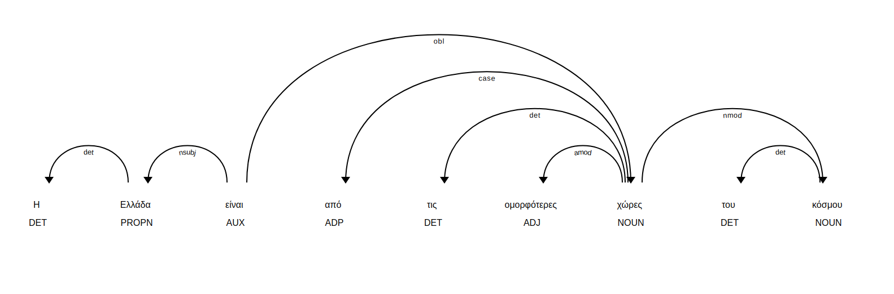
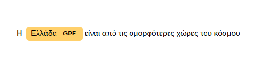

# Google Summer of Code 2018 Project - spaCy now speaks Greek

Welcome to the home repository of Greek language integration for spaCy.

This project is developed for **Google Summer of Code 2018**, under the auspices of **GFOSS - Open Technologies Alliance**.


## Readme Contents

1. [Problem Statement](#problem-statement - project goals)
2. [Results](#results)
   * [OpenSource Text Analysis Tool - Demo](#demo)
   * [Integration of Greek language to spaCy](#integration-of-greek-language-to-spacy)
   * [Greek language models](#greek-language-models)
   * [Empowerment of spaCy](empowerment-of-spacy)
3. [Stop words](#stop-words)
4. [Norm exceptions](#norm-exceptions)
5. [Lemmatizer](#lemmatizer)
6. [Contribute](#contribute)
7. [Lexical Attributes](#lexical-attributes)
8. [Models](#models)
9. [Named Entities Recognition](#ner)
10. [Part of Speech Tags](#pos)
11. [People](#people)


## Problem statement - project goals 

We live in the era of data. **Every minute**, 3.8 billion internet users, produce content; more than 120 million emails , 500.000 Facebook comments, 3 million Google searches. If we want to process that amount of data efficiently, we need to process natural language. Open source projects such as spaCy, textblob, or NLTK contribute significantly to that direction and thus they need to be reinforced.

This project is about improving the quality of Natural Language Processing of Greek Language. 

The **project goals** can be categorized as following: 

1. [Integration of Greek language](https://github.com/explosion/spaCy/pull/2558) to spaCy platform.  **Status: Complete**
2. Production of models for Part-Of-Speech (POS) tagging, Dependency Analysis (DEP) and Named Entities Recognition (NER), with and without vectors.  **Status: Complete**
3. An [open-source text analysis tool](nlp.wordgames.gr) (demo) in which everyone can perform common NLP tasks in 7 languages. **Status: Complete**.


## Results

### Demo

An open-source text analysis tool has been developed as a demonstration of the project results. 

The demo leverages [Spacy's](https://spacy.io)  capabilities to extract as much information as possible from a raw text. 

**Experiment yourself with the demo**:  [nlp.wordgames.gr](www.nlp.wordgames.gr)

Briefly, in this demo you can perform the following tasks with your text:

1. Language identification (performed using [langid](https://github.com/saffsd/langid.py) library).
2. Text tokenization.
3. Sentence splitting.
4. Tokens lemmatization.
5. Part of Speech tags identification.
6. Named Entity Recognition (Location, Person, Organization).
7. Text summarization (uses [Gensim's](https://github.com/RaRe-Technologies/gensim) implementation of the TextRank algorithm).
8. Keywords extraction.
9. For the Greek language, Categorization of text among the following categories: Sports, Science, World News, Greek News, Environment, Politics, Art, Health, Science. The Greek classifier is built with [FastText](https://fasttext.cc) and is trained in 20.000 articles labeled in these categories. **Accuracy reaches 90%**,

Currently, it supports the features mentioned above for text in one of the following languages: Greek, English, German, Spanish, Portuguese, French, Italian and Dutch. 

Text can either be provided or imported from a URL. Libraries used: [python readability](https://github.com/buriy/python-readability), [BeautifulSoup4](https://www.crummy.com/software/BeautifulSoup/).

#### Demo links

1. Demo itself: [nlp.wordgames.gr](www.nlp.wordgames.gr)
2. Demo code: [https://github.com/eellak/text-analysis](https://github.com/eellak/text-analysis)
3. Demo wiki page: https://github.com/eellak/text-analysis/wiki


### Integration of Greek language to spaCy

Greek language has been successfully integrated to spaCy, which was actually the most important goal of the project.

You can see the pull request [here](https://github.com/explosion/spaCy/pull/2558).

Each part of the process of integrating Greek language to spaCy is discussed in detail in a separate section after the Results section. 


### Greek language models

Two models for Greek language have been produced. There is an ongoing process of uploading them to spaCy release.

After that, you will be able to install them with the following commands:

```bash
python3 -m spacy download el_core_web_sm
python3 -m spacy download el_core_web_lg
```

 


For more info about the models, see the [models](#models) section.

   


 

### Empowerment of spaCy

A side goal of the project is to empower spaCy itself.

There is an open-dialogue with the creators of spaCy, who we would like to thank for their continuous support and enthusiasm.


#### Documentation improvements

A pull request for documentation improvements was successfully merged.

The pull request was about a small error found in the spaCy documentation in the pseudocode provided for overriding the spaCy tokenizer. 

You can see the pull request [here](https://github.com/explosion/spaCy/pull/2604).


#### Sharing awareness

There is an ongoing process of writing an article for [Explosion AI Blog](https://explosion.ai/blog/) regarding the integration of Greek language to spaCy. 

A link to the post will be published here when it's ready.


#### Innovative approaches

In the process of integrating Greek language to spaCy some new approaches are followed. 

1. Greek language is the second language that follows a rule based lemmatization procedure (see [lemmatizer](#lemmatizer) section for more info).
2. There were no available data for training NER classifier, so there was a need for creating data. A fast procedure of annotating data using Prodigy annotation tool is proposed for future reference (see [NER](#ner) section for more info).


## Stop-words

In this section, you will find out how Greek stop-words list is produced. 

> In [computing](https://en.wikipedia.org/wiki/Computing), **stop words** are words which are filtered out before or after [processing of natural language](https://en.wikipedia.org/wiki/Natural_language_processing) data (text).[[1\]](https://en.wikipedia.org/wiki/Stop_words#cite_note-1) Though "stop words" usually refers to the most common words in a language, there is no single universal list of stop words used by all [natural language processing](https://en.wikipedia.org/wiki/Natural_language_processing) tools, and indeed not all tools even use such a list. Some tools specifically avoid removing these stop words to support [phrase search](https://en.wikipedia.org/wiki/Phrase_search).


### Counting frequencies from Wikipedia dump

1. First, get a dump of Greek wikipedia:

   ```bash
    wget https://dumps.wikimedia.org/elwiki/latest/elwiki-latest-pages-articles.xml.bz2 
   ```

2. Secondly, use the following code to count word frequencies from the wikipedia dump and save the 300 most frequent words in a file, following [this](https://github.com/eellak/gsoc2018-spacy/blob/dev/spacy/lang/el/stop-words/stop_words.out) format.

   ```python
   import multiprocessing
   from collections import defaultdict
   from gensim.corpora import WikiCorpus, MmCorpus
   words = defaultdict(int)
   wiki = WikiCorpus("elwiki-latest-pages-articles.xml.bz2",lemmatize=False, dictionary={})
   sentences = list(wiki.get_texts())
   for sentence in sentences:
       for token in sentence:
           words[token]+=1
   ```

The full script can be found [here](https://github.com/eellak/gsoc2018-spacy/blob/dev/spacy/lang/el/stop-words/global-freqs/freqs_counter.py).

*Note*: A file with frequencies of Greek words can be found [here](https://github.com/eellak/gsoc2018-spacy/blob/dev/spacy/lang/el/stop-words/global-freqs/out.txt). The first column contains the occurrences of the word, the second column the number of documents in which the word occurred and the third column the word itself. 

### Adding words from other sources

The list extracted from Wikipedia is not enough, because it doesn't include a lot of personal forms, which for some applications might be good stop-word additions.

Because of that, we found it useful to add some words from the Open Subtitles list of words with their frequencies. The list can be found [here](https://github.com/eellak/gsoc2018-spacy/blob/dev/spacy/lang/el/stop-words/greek_stoplist.dat).


### Cross validation

The most frequent words from Wikipedia dump list and Open Subtitles list were concatenated and the output was checked manually in order to ensure the quality of the stop-words list.


### Final list

The final stop-words list can be found [here](https://github.com/explosion/spaCy/blob/master/spacy/lang/el/stop_words.py).


## Lemmatizer

>  **Lemmatization** usually refers to doing things properly with the use of a vocabulary and morphological analysis of words, normally aiming to remove inflectional endings only and to return the base or dictionary form of a word, which is known as the lemma.

The majority of the languages in spaCy are based on a lookup for lemmatization. That means, that most language models contain a static, huge file (usually called lookup.py or maybe lemmatizer.py) that contains a mapping of **all** of the words in the language to their lemma. The [author](https://github.com/giannisdaras.) believes that this approach lacks of scalability. The following section explains why.


### Reasons NOT to use a lookup for lemmatization

It is almost impossible for languages like Greek to use a lookup approach for lemmatization. There are plenty of reasons to justify it:

1. Verb forms in Greek are dependent on the tense. 

   Let me guess your first reaction; So what? English verb forms are dependent on tense too. For example, we can spot the word "play" in two (tense) forms; "play, played". However, the same verb in Greek "παίζω" can be spotted in the following (tense) forms: "παίζω, έπαιζα, έπαιξα, παίξω". That's double right? Making the silent assumption that the amount of verbs in Greek language is the same as in English, that leads us to a **2x increase** in the size of the verb section of the lookup. And we just started. :imp:

2. Verb forms in Greek are dependent on grammatical persons. 

   In English it goes like this:  

   ```
   I/You/We/They play, He/She/It plays.
   ```

   The situation in Greek language is much more complicated:

   ```
   Εγώ παίζω, Εσύ παίζεις, Αυτός/Αυτή/Αυτό παίζει, Εμείς παίζουμε, Εσείς παίζετε, Αυτοί παίζουν.
   ```

   You spot the difference, right? For just a single verb, we would have a **3x increase** in the verbs section of the lookup making the assumption that the amount of verbs in Greek language is equal to the amount of verbs in English language. Bearing in mind the first bullet, that actually leads us to **6x increase** coming from verb peculiarities in Greek language. 

3. Noun/Adjective forms in Greek are dependent on the cases (nominative/accusative/genitive/dative). 

   In English there is no case dependency to nouns; the noun change forms only from singular to plural version. However, in Greek nouns change depending on case. For example, the noun "γήπεδο" can be found in forms like "γήπεδο, γηπέδου, γηπέδων", the noun "ναυμαχία" can be found in  forms like "ναυμαχία, ναυμαχίας, ναυμαχίες, ναυμαχιών". That complicates things a lot and can lead to a more than **2x** increase of the nouns in the lookup table.

4. Adjective forms in Greek are dependent on the gender. 

   An English speaker may find difficulty to understand that. In English all the following sentences are valid: 

   ```
   he/she/it is beautiful
   ```

   However, in Greek we have three separate sentences:

   ```
   Αυτός είναι όμορφος.
   Αυτή είναι όμορφη.
   Αυτό είναι όμορφο.
   ```

   This causes a **3x** increase to the adjective section of the lookup compared to the English lookup table.

5. Adjective forms in Greek differ in singular and plural form.

   You are probably get used to saying 

   ```
   You (singular)/You (plural) are beautiful 
   ```

   but in Greek that would be 2 different sentences in terms of the adjective form: 

   ```
   Είσαι όμορφος.
   Είσαστε όμορφοι.
   ```

   In a way, adjectives in Greek behave like nouns which means that their plural form is different than their singular form. 

6. Adjective forms in Greek are dependent on the cases.

   It's the same as bullet 3 but for adjectives.


### How to create a lookup table

If you are not convinced that the lookup is not the best approach for lemmatization or if you are just curious how to create one, this section is for you. 

Firstly, you need to collect a list of all the lemmas in the language. Such a list can be collected through parsing wiktionary. If you are too lazy to do this or if you don't know how to do this, that's not a problem because we have already collected a list of lemmas based on their part of speech tag. You can navigate [here](https://github.com/explosion/spaCy/tree/master/spacy/lang/el/lemmatizer) and find the related files. 

After that, collect a list of a lot of Greek words. You can manually create this list (from a wikipedia dump maybe) or you can use an existing like the one that can be found [here](https://github.com/wooorm/dictionaries/tree/master/dictionaries/el). You can then use a stemmer and group words with common stem. For each group, find which of the words in the group is a lemma and create an entry with the rest of them in the lookup table. Then, you will need to clean the lookup (review and remove wrong entries, add some exceptions, etc.) and voila, your lookup is ready. 

A 22MB lookup produced for Greek language using this approach can be found [here](https://github.com/eellak/gsoc2018-spacy/blob/dev/spacy/lang/el/lemmatizer/lookup.py).


### Rule based approach

A rule based approach for lemmatization was introduced in the English language model and the logic is transfered to the Greek language model. The steps that someone needs to do to achieve rule based lemmatization with spaCy are the following:

1. Collect (normal) lemmas for each POS tag. For the Greek language, have a look [here](https://github.com/eellak/gsoc2018-spacy/tree/dev/spacy/lang/el/lemmatizer).
2. Collect exception lemmas for each POS tag. For the Greek language, have a look [here](https://github.com/eellak/gsoc2018-spacy/tree/dev/spacy/lang/el/lemmatizer).
3. Write rules for each POS tag that transform the suffixes of a token in a way that the token becomes lemma. If you didn't understand what I just said don't worry, I will explain it further. Lemmatization using rules in spaCy does the following; given a token, it finds its POS tag and it tries to replace a suffix of the word with another suffix in order to convert it to a lemma of the same POS tag. So the idea here is to notice the patterns (for example lemma adjectives in Greek word often end to "-δης", e.g. "πνευματώδης" while adjectives that are not lemmas often end to "-δεις", e.g "πνευματώδεις") and write appropriate mappings between the suffixes (for example we could create for adjectives a rule that maps "-δεις" to the lemma suffix "-δης"). Lemmatization rules for the Greek language can be found [here](https://github.com/eellak/gsoc2018-spacy/blob/dev/spacy/lang/el/lemmatizer/_lemma_rules.py). 

Exceptions and rules define completely the rule based lemmatization procedure which is more scalable, more memory efficient and less painful than the traditional lookup approach for lemmatization.


## Contribute

If you are interested in extending or improving the Greek class of spaCy or the Greek models
(el_core_web_sm, el_core_web_lg) this place is for you. 

There are some suggestions on things you could work on if you are interested. There is a difficulty score assigned to each task and an analytical description following for each of them.

First, here is a list of things that you could do to improve the Greek language support for spaCy:

1. Add more rules to lemmatizer (difficulty: *easy*)
2. Overwrite the spaCy tokenizer (difficulty: *hard*)
3. Add noun chunks (difficulty: *medium*)
4. Improve models accuracy  (difficulty: *medium*)

### Add more rules to lemmatizer

First, it is highly recommended to have a look [here](https://github.com/eellak/gsoc2018-spacy/wiki/Lemmatizer) in order to understand the lemmatization approach used in Greek language.

If you are reading this, it is assumed that you have read the wiki page and you are comfortable enough with the approach followed.

Let's assume that you want to lemmatize the following sentence:

"Όταν η συμφορά συμφέρει, λογάριαζε την για πόρνη."

Normally, you would do something like this:

```python
import spacy
nlp = spacy.load('el_core_web_sm')
doc = nlp('Όταν η συμφορά συμφέρει, λογάριαζε την για πόρνη.')
for token in doc:
    print(token.tag_, token.lemma_)
```

The output is:

``` εάν
SCONJ όταν
DET η
NOUN συμφορά
VERB συμφέρω
PUNCT ,
VERB λογάριαζε
PRON την
ADP για
NOUN πόρνη
PUNCT .
```

You just discovered that it didn't find the correct lemma for the verb
"λογάριαζε".  This means that one of the following things happened: 

* The POS tag is wrong. The model predicted wrong the POS tag so the
  transformation rules failed. In our example, this didn't happen but
  it's actually pretty common. If this happens often, you may need to
  check the section following about improving models accuracy. 

* There is a rule missing. That's the case here. You need to add this
  rule (or any other rule missing) to the appropriate category. You
  have to update [this](https://github.com/eellak/gsoc2018-spacy/blob/master/spacy/lang/el/lemmatizer/_lemma_rules.py) file. "λογάριαζε" is a verb so you should update the

   VERB_RULES list. The correct lemma is "λογαριάζω", so an appropriate rule 

  to add would be "-άζε" to "-άζω". You should be **really careful** when

  adding new rules:  The more specific the rule is, the better. Also,
  check that the new rule is not breaking any of the tests provided
  (*Coming soon*). 

* The word is an exception. There are cases in which the
  transformation rules are correct but they cannot be applied to this
  token because the word it represents is an exception. There are
  exceptions for [verbs](https://github.com/eellak/gsoc2018-spacy/blob/master/spacy/lang/el/lemmatizer/_verbs_irreg.py), [adjectives](https://github.com/eellak/gsoc2018-spacy/blob/master/spacy/lang/el/lemmatizer/_adjectives_irreg.py), [dets](https://github.com/eellak/gsoc2018-spacy/blob/master/spacy/lang/el/lemmatizer/_dets_irreg.py), [nouns](https://github.com/eellak/gsoc2018-spacy/blob/master/spacy/lang/el/lemmatizer/_nouns_irreg.py).
  If you think this is the case for the "wrong" lemmatization you
  spotted, update the corresponding file. Again, make sure that it
  doesn't break any of the tests (*Coming soon*). 


### Overwrite the spaCy tokenizer

Each language modifies the spaCy tokenization procedure by adding  tokenizer exceptions.

The tokenizer exceptions approach is not scalable for languages such
as Greek. If you are wondering why, have a look [here](https://github.com/eellak/gsoc2018-spacy/wiki/Lemmatizer#reasons-not-to-use-a-lookup-for-lemmatization), the reasons are pretty much the same.

A new approach, rule-based tokenization is proposed. The repo owners are currently working on that, but any help is welcome. The steps we are taking are: 

1. Rewrite the spaCy tokenizer in pure Python, following the
   pseudo-code provided [here](https://spacy.io/usage/linguistic-features#tokenization).
   This is already done, you can find the code [here](https://github.com/eellak/gsoc2018-spacy/blob/dev/spacy/lang/el/tokenizer.py). 
2. Write regex expressions to catch the following phenomena of Greek
   language: "εκθλίψεις", "αφαιρέσεις", "αποκοπές". This is an ongoing
   process. 
3. Transform the tokens that match one of the phenomena mentioned
   above, to other(s) tokens using transformation rules. This is an
   ongoing process. 


### Add noun chunks

Instructions coming soon.

### Improve models accuracy

Instructions coming soon.


## Lexical Attributes

spaCy includes a collection of functions that can identify whether a
token has some specific attributes (for example, it is a URL!).

### spaCy built-in functions for lexical attributes

For a complete list of spaCy built-in functions for lexical attributes
have a look [here](https://github.com/explosion/spaCy/issues/1439). 

### Greek modifications to spaCy built-in functions

Currently, the Greek spaCy models have overwritten only like_num spaCy
function which checks if a token represents a numerical expression.

The modifications include a check in a list of words that represent
numerical expressions in Greek, a check whether the token represents a
fraction or a check whether the token represents a power of a number.

In this way, we can catch expressions like the following:


​											δεκατέσσερις

​											εκατομμύριο


## POS

Definition from [Wikipedia](https://en.wikipedia.org/wiki/Part-of-speech_tagging): 

> In [corpus linguistics](https://en.wikipedia.org/wiki/Corpus_linguistics), **part-of-speech tagging** (**POS tagging** or **PoS tagging** or **POST**), also called **grammatical tagging** or **word-category disambiguation**, is the process of marking up a word in a text (corpus) as corresponding to a particular part of speech, base on both its definition and its context—i.e., its relationship with adjacent and related words in a phrase, sentence, or paragraph. A simplified form of this is commonly taught to school-age children, in the identification of words as nouns, verbs, adjectives, adverbs, etc.


### Greek POS tags

The POS tags for Greek language are based on the [Universal POS tags](http://universaldependencies.org/u/pos/all.html). They are defined in the tag map [file](https://github.com/eellak/gsoc2018-spacy/blob/master/spacy/lang/el/tag_map_general.py). 

The Universal POS tags schema is followed because there is a public
annotated Greek Dependency Treebank
[here](https://github.com/UniversalDependencies/UD_Greek-GDT) which is based on the Universal POS tags and thus there was an important potential for a good kickoff for a spaCy model for POS tagging in Greek language. 

The Universal POS tags (with their definitions in Greek language and some clarifications) are the following:

1. ADJ: επίθετα
2. ADV: επιρρήματα
3. ADP: προθέσεις
4. AUX: ρήματα για σχηματισμό χρόνων
5. INTJ: επιφωνήματα
6. PROPN: ουσιαστικά που χρησιμοποιούνται ως ονόματα
7. VERB: ρήματα
8. CCONJ: παρατακτικοί σύνδεσμοι
9. SCONJ: υποτακτικοί σύνδεσμοι
10. PART: μόρια
11. PUNCT: σημεία στίξης
12. SYM: σύμβολα
13. NUM: αριθμητικά
14. PRON: αντωνυμίες
15. SPACE: κενό
16. DET: άρθρα
17. NOUN: ουσιαστικά

*Note*: In the Greek UD Treebank there are no annotations for the SPACE tag. There is a need for further annotation so the model can learn the SPACE tag. Coming soon.


### Extended Greek POS tags

There is also an extended list of Greek POS tags for a more sophisticated model that can be used in the future if there is appropriate annotated dataset. These tags are listed [here](https://github.com/eellak/gsoc2018-spacy/blob/master/spacy/lang/el/tag_map.py) for future reference and use. 


## Norm Exceptions

From the documentation [page](https://spacy.io/usage/adding-languages#norm-exceptions) of spaCy: 

> spaCy usually tries to normalise words with different spellings to a single, common spelling. This has no effect on any other token attributes, or tokenization in general, but it ensures that **equivalent tokens receive similar representations**. This can improve the model's predictions on words that weren't common in the training data, but are equivalent to other words – for example, "realize" and "realise", or "thx" and "thanks".


### Greek language norm exceptions

The list of norm exceptions in Greek is constructed by appropriate parsing of a Greek dictionary. 

Usually, dictionaries have a symbol that maps a word to another word that it is a slight variation of itself (i.e., a norm-exception). In the dictionary we parsed, this symbol was "->".

The full list can be found [here](https://github.com/eellak/gsoc2018-spacy/blob/dev/spacy/lang/el/norm_exceptions.py).

In the list, the first column contains the exceptions and the second column contains the corresponding norms. 

For extending the list, please see the [Contribute](#contribute) page.


## Models

From the spaCy [documentation](https://github.com/explosion/spacy-models#model-naming-conventions):

> In general, spaCy expects all model packages to follow the naming convention of `[lang]_[name]`. For our models, we also chose to divide the name into three components:
>
> - **type**: Model capabilities (e.g. `core` for general-purpose model with vocabulary, syntax, entities and word vectors, or `depent` for only vocab, syntax and entities)
> - **genre**: Type of text the model is trained on (e.g. `web` for web text, `news` for news text)
> - **size**: Model size indicator (`sm`, `md` or `lg`)
>
> For example, `en_depent_web_md` is a medium-sized English model trained on written web text (blogs, news, comments), that includes vocabulary, syntax and entities.


### Greek language models

Following the name conventions mentioned above, two models have been trained for Greek language:

1. **el_core_web_sm**: Vocabulary, syntax, entities.
2. **el_core_web_lg**: Vocabulary, syntax, entities, word-vectors.


### Models usage

* Import model:

  ```python
  import spacy
  nlp = spacy.load('el_core_web_sm')
  # For the model with vectors, run the following command:
  # nlp = spacy.load('el_core_web_lg')
  ```

  

* Get doc object:

  ```python
  # replace with your own text
  text = "Η Ελλάδα είναι από τις ομορφότερες χώρες του κόσμου"
  doc = nlp(text)
  ```

  

* Tokenize and lemmatize your sentence:

  ```python
  for token in doc:
  	print("Token:{}, Lemma:{}".format(token, token.lemma_))
  ```

  Output:

  ​	Token:Η, Lemma:η
  	Token:Ελλάδα, Lemma:ελλάδα
  	Token:είναι, Lemma:είναι
  	Token:από, Lemma:από
  	Token:τις, Lemma:τις
  	Token:ομορφότερες, Lemma:ομορφός
  	Token:χώρες, Lemma:χώρα
  	Token:του, Lemma:του
  	Token:κόσμου, Lemma:κόσμου

  

* Get POS tags for each of the tokens

  ```python
  for token in doc:
  	print("Token:{}, Tag:{}".format(token, token.tag_))
  ```

  Output:

  ​	Token:Η, Tag:DET
  	Token:Ελλάδα, Tag:PROPN
  	Token:είναι, Tag:AUX
  	Token:από, Tag:ADP
  	Token:τις, Tag:DET
  	Token:ομορφότερες, Tag:ADJ
  	Token:χώρες, Tag:NOUN
  	Token:του, Tag:DET
  	Token:κόσμου, Tag:NOUN

  

* Visualize POS tags and Dependencies

  ```
  from spacy import displacy
  displacy.serve(doc)
  ```

  

* Get Named Entities out of your sentence

  ```python
  for ent in doc.ents:
  	print("Entity:{}, Label:{}".format(ent.text, ent.label_))
  ```

  Output:

  ​	Entity:Ελλάδα, Label:GPE

  

* Visualize Named Entities

  ```python
  from spacy import displacy
  displacy.serve(doc, style="ent")
  ```

  

* Detect similarity between texts

  ```python
  # for this, we will need the model with the word-vectors
  nlp = spacy.load('el_core_web_lg')
  doc1 = nlp('Οι πυροσβέστες ψάχνουν αγωνιωδώς για επιζώντες. Οι φωτιές διέλυσαν τα πάντα. Τα πάντα είναι απανθρακωμένα.')
  doc2 = nlp('Το Πυροσβεστικό Σώμα συνεχίζει να αναζητά τους αγνωούμενους. Η πυρκαγιά κατέλυσε όλη την περιοχή. Όλα έγιναν στάχτη και κάρβουνο.')
  doc3 = nlp('Χθες αγόρασα ένα σκύλο! Και μια γάτα! Και ένα κουνέλι!')
  print(doc1.similarity(doc2))
  print(doc1.similarity(doc3))
  ```

  Output:

  0.7155315553393391
  0.46625177182352695	

  As we expected, the first two sentences that are semantically close have high similarity score. Contrary to this, the first and the last sentence that talk about different topics have lower similarity score.


## People

* Google Summer of Code participant: [Ioannis Daras](https://github.com/giannisdaras)

* Mentor: [Markos Gogoulos](https://github.com/mgogoulos)

* Mentor: [Panos Louridas](https://github.com/louridas)

  

## Licensing

The project is forked from spaCy.io so it uses MIT License.


